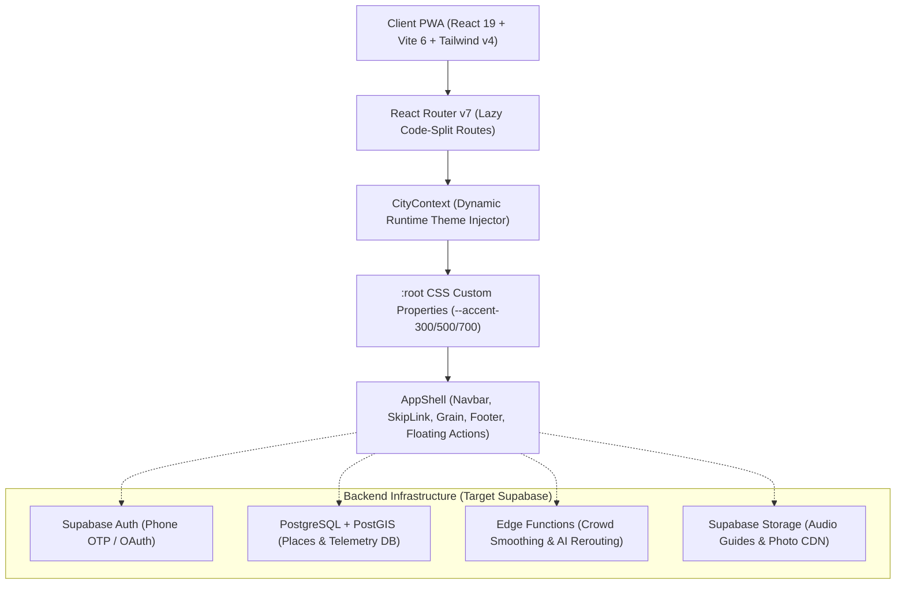
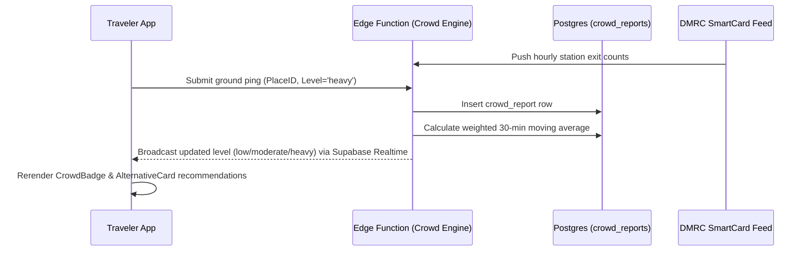

# FINDIA — Technical Design Document (TLD)

---

## 1. System Architecture Overview



---

## 2. Technology Stack & Version Matrix

- **Runtime & Language**: Node.js v20.18+, ECMAScript 2024 (JavaScript / JSX).
- **Frontend Framework**: React v19.0.0.
- **Bundler & Tooling**: Vite v6.2.0, `@vitejs/plugin-react` v4.3.4.
- **Styling Architecture**: Tailwind CSS v4.0.0 (`@tailwindcss/vite` CSS-first engine).
- **Client Routing**: React Router v7.2.0 (`react-router-dom`).
- **PWA Service Worker**: `vite-plugin-pwa` v1.3.0, Workbox v7.3.0.
- **Target Database & Auth**: Supabase PostgreSQL 15+, PostGIS 3.3+.

---

## 3. Dynamic City Configuration & Accent Pipeline

### Why CSS Custom Properties over Per-City Tailwind Builds?
Traditional multi-brand or multi-tenant architectures compile separate CSS bundles per brand or generate inflated utility classes (e.g. `delhi:bg-terracotta`, `jaipur:bg-pink`). This bloats CSS bundle size and prevents instantaneous runtime switching.

FINDIA employs a dynamic CSS custom property pipeline:
1. All semantic tokens in `src/styles/index.css` map to variables:
   ```css
   @theme {
     --color-brand: var(--accent-500);
     --color-accent-300: var(--accent-300);
     --color-accent-500: var(--accent-500);
     --color-accent-700: var(--accent-700);
     --color-accent-soft: color-mix(in srgb, var(--accent-500) 15%, transparent);
   }
   ```
2. City registry files (`src/config/cities/*.js`) declare color ramps:
   - Delhi: `--accent-500: #C1440E` (Sandstone Terracotta)
   - Jaipur: `--accent-500: #C2185B` (Hawa Mahal Pink)
3. Upon city change in `CityContext`, an effect executes:
   ```javascript
   document.documentElement.style.setProperty('--accent-300', city.accent[300]);
   document.documentElement.style.setProperty('--accent-500', city.accent[500]);
   document.documentElement.style.setProperty('--accent-700', city.accent[700]);
   ```
4. Every button, overline, glowing ring, and border across the application updates instantaneously within 1 browser paint frame with **zero network requests and zero page reloads**.

---

## 4. Complete Supabase Database Schema

### 4.1 Table Definitions

```sql
-- 1. USERS & PROFILES
create table public.profiles (
  id uuid references auth.users on delete cascade primary key,
  phone text unique,
  display_name text not null,
  badge text default 'Traveler',
  is_verified boolean default false,
  created_at timestamptz default now()
);

-- 2. DISTRICTS
create table public.districts (
  id uuid default gen_random_uuid() primary key,
  city_slug text not null,
  slug text not null unique,
  name text not null,
  boundary_geojson jsonb,
  created_at timestamptz default now()
);

-- 3. PLACES (Monuments, Stepwells, Bazaars)
create table public.places (
  id uuid default gen_random_uuid() primary key,
  city_slug text not null,
  district_id uuid references public.districts(id) on delete set null,
  slug text not null unique,
  name text not null,
  category text not null, -- 'monument' | 'stepwell' | 'garden' | 'bazaar'
  description text not null,
  fact text not null,
  inconvenience text,
  fee_inr numeric default 0,
  is_free boolean default false,
  duration_minutes integer default 60,
  timings text not null,
  metro_station text not null,
  metro_line text not null,
  how_to_reach text not null,
  image_url text not null,
  location geography(Point, 4326),
  created_at timestamptz default now()
);

-- 4. CROWD REPORTS & TELEMETRY
create table public.crowd_reports (
  id uuid default gen_random_uuid() primary key,
  place_id uuid references public.places(id) on delete cascade,
  user_id uuid references public.profiles(id) on delete set null,
  crowd_level text not null check (crowd_level in ('low', 'moderate', 'heavy')),
  wait_time_minutes integer,
  source text not null check (source in ('user_ping', 'dmrc_sensor', 'popular_times')),
  reported_at timestamptz default now()
);

-- 5. AUDIO GUIDES
create table public.audio_guides (
  id uuid default gen_random_uuid() primary key,
  place_id uuid references public.places(id) on delete cascade unique,
  title text not null,
  narrator text not null,
  audio_url text not null,
  duration_seconds integer not null,
  transcript text,
  created_at timestamptz default now()
);

-- 6. ITINERARIES
create table public.itineraries (
  id uuid default gen_random_uuid() primary key,
  user_id uuid references public.profiles(id) on delete cascade,
  city_slug text not null,
  title text not null,
  total_days integer default 1,
  schedule_json jsonb not null,
  created_at timestamptz default now()
);

-- 7. COMMUNITY THREADS
create table public.threads (
  id uuid default gen_random_uuid() primary key,
  user_id uuid references public.profiles(id) on delete set null,
  city_slug text not null,
  tag text not null check (tag in ('lost-and-found', 'meetup', 'safety', 'food', 'transport', 'photography', 'general')),
  title text not null,
  body text not null,
  views_count integer default 0,
  created_at timestamptz default now()
);

-- 8. COMMUNITY REPLIES
create table public.replies (
  id uuid default gen_random_uuid() primary key,
  thread_id uuid references public.threads(id) on delete cascade,
  user_id uuid references public.profiles(id) on delete set null,
  parent_reply_id uuid references public.replies(id) on delete cascade,
  body text not null,
  created_at timestamptz default now()
);

-- 9. TRAVEL TOGETHER GROUPS
create table public.travel_groups (
  id uuid default gen_random_uuid() primary key,
  host_id uuid references public.profiles(id) on delete cascade,
  city_slug text not null,
  title text not null,
  destination text not null,
  meeting_point text not null,
  start_time timestamptz not null,
  max_spots integer not null check (max_spots >= 2),
  description text not null,
  created_at timestamptz default now()
);

-- 10. SOS & EMERGENCY CONTACTS
create table public.user_sos_contacts (
  id uuid default gen_random_uuid() primary key,
  user_id uuid references public.profiles(id) on delete cascade,
  contact_name text not null,
  phone_number text not null,
  relationship text,
  created_at timestamptz default now()
);
```

### 4.2 Row-Level Security (RLS) Policies
- **Places, Districts & Audio Guides**: Read-only public (`auth.role() = 'anon'` or `'authenticated'`). Writes restricted to `service_role` (admin).
- **Crowd Reports**: Public read. Authenticated users can insert reports (`auth.uid() = user_id`).
- **Threads & Replies**: Public read. Authenticated users can insert and update their own records (`auth.uid() = user_id`).
- **User SOS Contacts**: Strictly private to the owning user (`auth.uid() = user_id`).

---

## 5. State Management & Component Architecture

### Why No External State Library (Redux / Zustand)?
FINDIA operates entirely on native React 19 primitives:
- **`CityContext`**: Global singleton managing active city slug, reading/writing `localStorage`, and binding CSS custom properties. Memoized via `useMemo` to eliminate downstream re-renders.
- **URL Search Params**: Query filters, active tabs, and sort selections live directly in the URL query string (`?category=stepwells`), allowing deep linking and frictionless browser back-navigation.
- **Local Component State (`useState`, `useRef`)**: Modal sheets, audio player progress, and form inputs reside in local component lifecycles.

### One-Way Dependency Rule
- `src/components/common` -> imports only utilities (`cn.js`) and icons (`src/components/icons`).
- `src/components/layout` -> imports common components and icons.
- `src/features` -> imports common, layout, and icons.
- `src/pages` -> composes layout and feature sections.
- **Zero cyclical imports**: Feature folders NEVER import from other feature folders.

---

## 6. Real-Time Crowd Telemetry Data Flow



- **Time Decay Handling**: Ground pings decay linearly over 45 minutes. A report older than 60 minutes is purged from the active rolling window.
- **Outlier Mitigation**: Sudden shifts require at least two corroborating user pings or matching DMRC station congestion spikes before flipping badge state from `low` to `heavy`.

---

## 7. Performance & Accessibility Verification Standards

- **Bundle Budget**: Initial JS payload < 300 kB; Route chunks < 15 kB.
- **Zero Cumulative Layout Shift (CLS)**: Every `` carries an explicit aspect ratio wrapper class (`aspect-[16/10]`, `aspect-[4/3]`).
- **Color Contrast Guarantee**: All text elements satisfy WCAG AA (>= 4.5:1 for body copy; >= 3:1 for large display titles). Tested with contrast calibration script.
- **Reduced Motion**: All CSS transitions and counter intervals are wrapped with `prefers-reduced-motion: reduce` overrides.

---

## 8. Open Technical Risks & Mitigation

1. **Risk: Offline Connectivity in Metro Basements**: Underground metro stations often lack cellular coverage.
   - *Mitigation*: Service worker precaches the entire directory and emergency numbers offline via Workbox.
2. **Risk: Crowd Report Gaming**: Bad actors falsely reporting a monument as heavy to clear crowds.
   - *Mitigation*: GPS geofencing requires the device to be within 150m of the monument perimeter to submit a valid ping.
